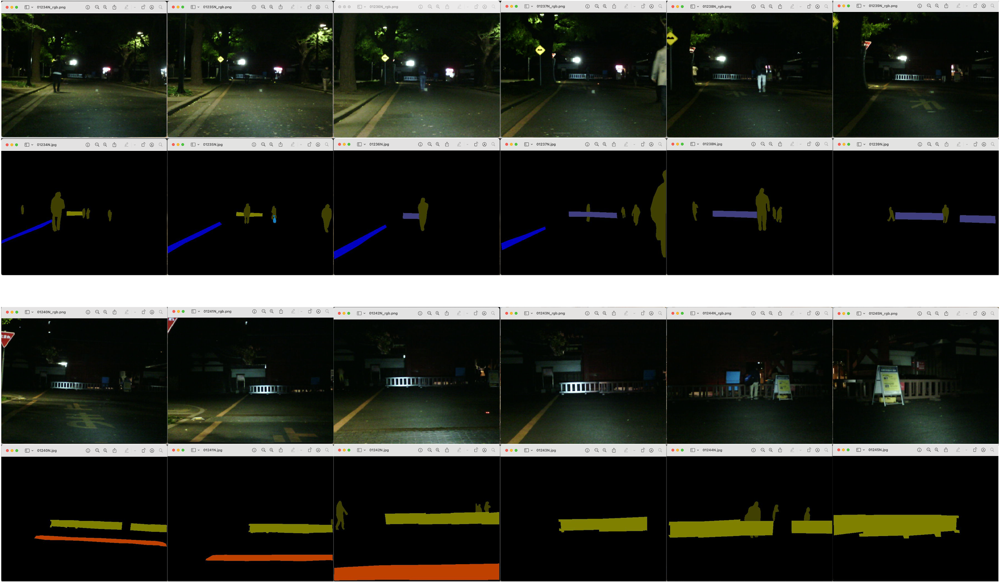

<div align="center">

# PEAFusion

</div>


This is the official pytorch implementation of the paper:
 >PEAFusion: Parameter-efficient Adaptation for RGB-Thermal fusion-based semantic segmentation
 >
 >Yan Wang, Henry K. Chu, Yuxiang Sun
 >
 >[[Paper](https://labsun.org/pub/INFFUS2025_peafusion.pdf)]

## Usage

### Installation
This codebase was developed and tested with the following packages. 
- OS: Ubuntu 20.04
- CUDA: 11.3
- PyTorch: 1.12.1
- Python: 3.12.1
- Detectron2: 0.6
- pytorch-lightning: 2.0.0
  
You can set the environment via the commands below:
```bash
conda create --name PEAFusion python=3.8 pytorch=1.12.1 torchvision=0.13.1 cudatoolkit=11.3 -c pytorch -c conda-forge
conda activate PEAFusion
python -m pip install detectron2 -f \
  https://dl.fbaipublicfiles.com/detectron2/wheels/cu113/torch1.12/index.html
pip install mmcv==1.7.1 pytorch-lightning==2.0.0 scikit-learn==1.2.2 timm==0.6.13 imageio==2.27.0 setuptools==59.5.0
pip install protobuf==3.20.3
```
After building conda environment, compile CUDA kernel for MSDeformAttn.
If you have trouble, refer [here](https://github.com/facebookresearch/Mask2Former/blob/main/INSTALL.md)
```
cd models/mask2former/pixel_decoder/ops/
sh make.sh
```
### Dataset
Download the datasets and place them in the 'datasets' folder with the following structure:
- [PST900 dataset](https://github.com/ShreyasSkandanS/pst900_thermal_rgb)
- [FMB dataset](https://github.com/JinyuanLiu-CV/SegMiF)
- [MF dataset](https://www.mi.t.u-tokyo.ac.jp/static/projects/mil_multispectral/)

```shell
<datasets>
|-- <PSTdataset>
    |-- <train>
        |-- rgb
        |-- thermal
        |-- labels
        ...
    |-- <test>
        |-- rgb
        |-- thermal
        |-- labels
        ...
|-- <FMB_dataset>
    |-- <train>
        |-- color
        |-- Infrared
        |-- Label
        |-- Visible
        ...
    |-- <test>
        |-- color
        |-- Infrared
        |-- Label
        |-- Visible
        ...
|-- <MFdataset>
    |-- <images>
    |-- <labels>
    |-- train.txt
    |-- val.txt
    |-- test.txt
    ...
```
Note:
You may notice that the performance on the guardrail class is unacceptably low. This may be due to annotation errors in the guardrail class. The images in the test set containing guardrails are ['01236N', '01237N', '01238N', '01239N']; however, we found that the same object, which is labeled as a guardrail in these images, is annotated as a car stop in ['01234N', '01235N', '01240N', '01241N', '01242N', '01243N', '01244N', '01245N']. When the same object in the mentioned images is correctly annotated as a guardrail, the model achieves better and more balanced performance. (*This result does not appear in the paper.*)



### Pre-trained Swin-V2 backbone
Download pretrained backbones from [here](https://drive.google.com/drive/folders/1BkkE-PuN2Ypm27jdNfQtMoz1RFUZyGF1?usp=sharing) and place them in 'pretrained_model' folder in the following structure:
```shell
<pretrained_model>
|-- <swinv2_tiny>
    ...
```
If path errors are raised, please check the path of the pretrained backbones defined in the config file.

### Evaluation
Evaluate the trained model by running
```bash
CUDA_VISIBLE_DEVICES=0 python test.py --config-file "./configs/PSTdataset/swin_v2/swin_v2_tiny.yaml" --num-gpus 1 --name peafusion_tiny_pst_eval --checkpoint "PATH for WEIGHT"
```

### Training
Train a model with the config file. If you want to change hyperparamter, edit config file in 'configs' folder.

> Single GPU, PST dataset, Swin v2 tiny backbone
```bash
CUDA_VISIBLE_DEVICES=0 python train.py --config-file "./configs/PSTdataset/swin_v2/swin_v2_tiny.yaml" --num-gpus 1 --name peafusion_tiny_pst
```

> Multi GPUs, PST dataset, Swin v2 tiny backbone
```bash
CUDA_VISIBLE_DEVICES=0,1 python train.py --config-file "./configs/PSTdataset/swin_v2/swin_v2_tiny.yaml" --num-gpus 2 --name peafusion_tiny_pst_2gpus
```
You can start a `tensorboard` session to check training progress by runing
```bash
tensorboard --logdir=checkpoints/
```
then observe the progress by opening [https://localhost:6006](https://localhost:6006) on your browser. 


## Result
You can download our pretrained weights for three RGB-T semantic segmentation datasets from [here](https://drive.google.com/drive/folders/1MvsdRVTh7_VUJG8Z1Ll6tbinoUDUeJu8?usp=sharing) and conduct evaluations.

## License
Shield: [](https://opensource.org/licenses/MIT)

Our code is licensed under a [MIT License](LICENSE).

## Citation

Please cite the following paper if you use our work in your research.

```
@article{wang2025peafusion,
author = {Yan Wang and Henry K. Chu and Yuxiang Sun},
title = {PEAFusion: Parameter-efficient Adaptation for RGB-Thermal fusion-based semantic segmentation},
journal = {Information Fusion},
volume = {120},
pages = {103030},
year = {2025},
issn = {1566-2535},
doi = {https://doi.org/10.1016/j.inffus.2025.103030}
}
```

## Related projects & Acknowledgement
Our network architecture and codebase are built upon CRM_RGBTSeg. 
* [CRM_RGBTSeg](https://github.com/UkcheolShin/CRM_RGBTSeg) (ICRA 2024)

## Contact
If you have any questions, please contact:
* Yan Wang [<danielwang8163@gmail.com>]